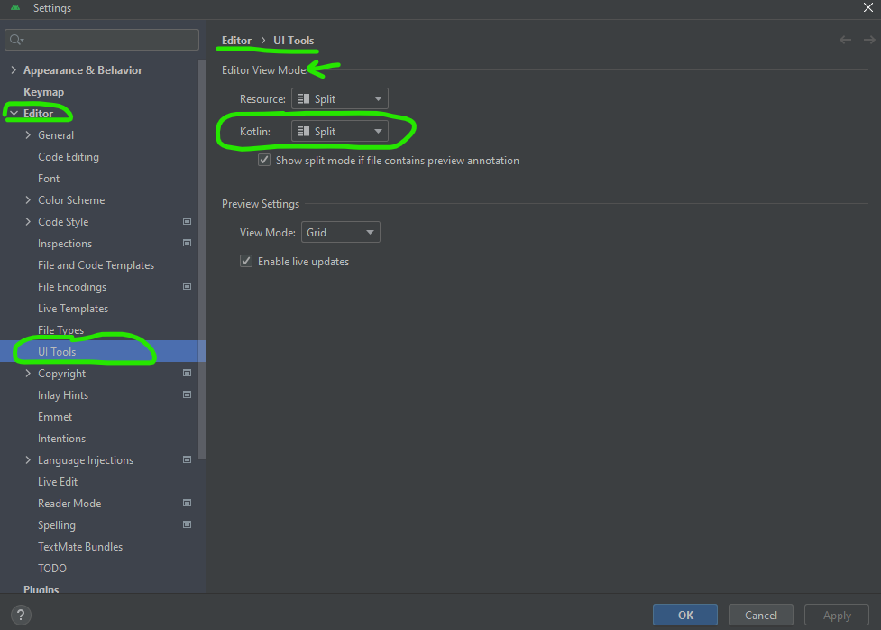

android-kotlin-hello-world
==========================
[./app/src/main/java/com/example/myapplication/MainActivity.kt](./app/src/main/java/com/example/myapplication/MainActivity.kt)

### Playground
- https://play.kotlinlang.org/

### Docs
- https://developer.android.com/develop/ui/compose/components/button
- [JetBrains/kotlin-web-site: The Kotlin programming language website](https://github.com/JetBrains/kotlin-web-site)

### Jetpack Compose

### Parsing
- https://github.com/Kotlin/kotlin-spec/tree/release
- https://github.com/Kotlin/grammar-tools/tree/master

### Tutorials
- https://kotlinlang.org/docs/kotlin-tour-control-flow.html#when
- https://kotlinlang.org/docs/kotlin-tour-classes.html#properties
